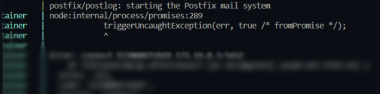

# Run npm install in both "frontend" & "backend" folders.
### Make sure *docker desktop* is running
1. Open the terminal and make sure you are in the "root" and run `docker compose up --build`. *(You only run it once at the start, rest of the time you can just run `docker compose up` to start the containers)*

2. You should get a problem similar to this:
 

3. To resolve the problem, Open a new terminal, run this command: `docker inspect -f '{{range.NetworkSettings.Networks}}{{.IPAddress}}{{end}}' postgres`.
You will get a IP address, copy it and paste it into `DB_HOST` in `.env`. The problem should be resolved. If not, you did something wrong.

4. Open browser and go to pgadmin (`localhost:8080`) and login.
   - Username: `akidaa@admin.com`
   - Password: `admin`

5. Setup a new db connection //TODO

6. Go to `localhost:3001/setup` to insert data into the database.

7. Your good to roll, go back to your room and start coding.
